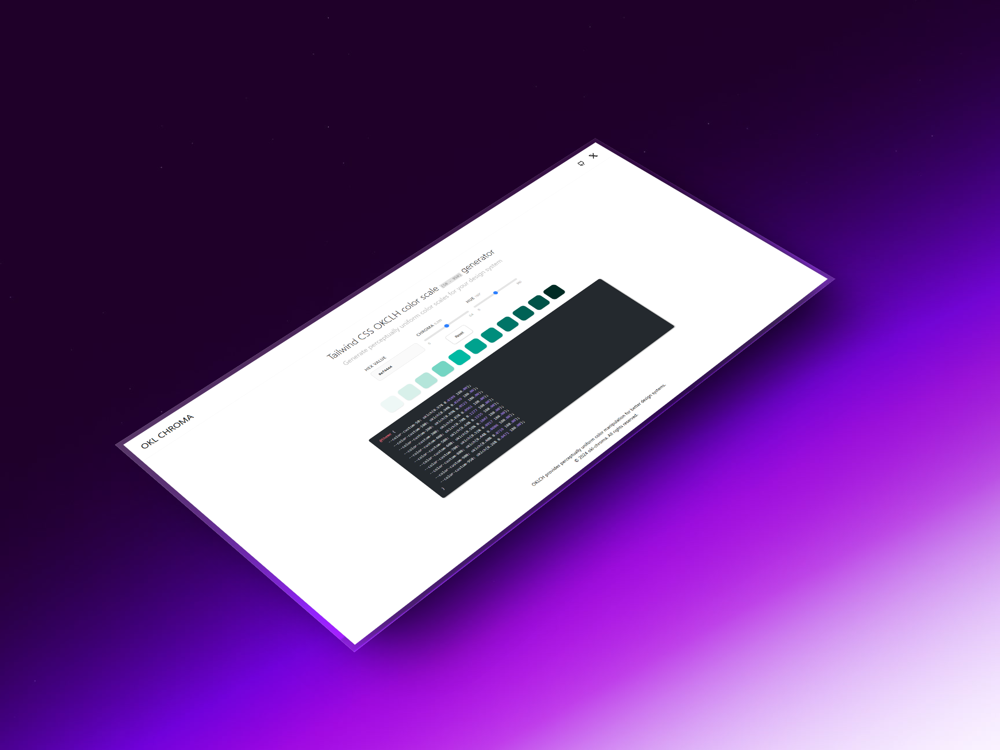

# OKLCH Color Scale Generator



Un generador de escalas de colores perceptualmente uniformes usando el espacio de color OKLCH. Crea paletas de colores Tailwind CSS compatibles con mejor uniformidad perceptual que HSL o RGB tradicionales.

Español | **[English](./README.md)**

## 🎨 Características

- **Espacio de color OKLCH**: Genera colores con uniformidad perceptual superior
- **Escalas automáticas**: Crea escalas de 11 tonos (50-950) automáticamente
- **Personalización**: Ajusta Chroma y Hue manualmente para resultados precisos
- **Generación en tiempo real**: La paleta se actualiza automáticamente al modificar valores
- **Exportación CSS**: Genera código CSS listo para usar con Tailwind CSS v4
- **Compatibilidad sRGB**: Los colores se ajustan automáticamente para mantenerse dentro del gamut
- **Iconos tipo Expo**: Sistema de iconos inspirado en @expo/vector-icons

<!--
## 🚀 Demo
Visita la demo en vivo: [URL de tu deploy]
-->

## 📦 Instalación

```bash
# Clonar el repositorio
git clone https://github.com/tu-usuario/okl-chroma.git
cd okl-chroma

# Instalar dependencias
pnpm install

# Iniciar servidor de desarrollo
pnpm dev
```

## 🛠️ Tecnologías

- [Astro](https://astro.build/) - Framework web moderno
- [Tailwind CSS v4](https://tailwindcss.com/) - Framework CSS utilitario
- [OKLCH Color Space](https://evilmartians.com/chronicles/oklch-in-css-why-quit-rgb-hsl) - Espacio de color perceptualmente uniforme
- [Astro Expressive Code](https://expressive-code.com/) - Syntax highlighting
- [TypeScript](https://www.typescriptlang.org/) - Tipado estático

## 📁 Estructura del Proyecto

```
okl-chroma/
├── public/                 # Archivos estáticos
├── src/
│   ├── components/         # Componentes reutilizables
│   │   ├── ui/            # Componentes de UI (IconSymbol, Link)
│   │   ├── Header.astro
│   │   ├── Navbar.astro
│   │   └── Footer.astro
│   ├── layouts/           # Layouts de Astro
│   │   └── Layout.astro
│   ├── lib/              # Lógica y utilidades
│   │   └── index.ts      # Funciones de conversión OKLCH
│   ├── pages/            # Rutas de la aplicación
│   │   ├── index.astro   # Página principal
│   │   └── api/          # API routes
│   │       └── render-code.ts
│   ├── sections/         # Secciones de la página
│   │   ├── Controls.astro
│   │   └── PalettePreview.astro
│   ├── constants/        # Constantes de la aplicación
│   │   └── index.ts      # Icon mapping y configuración
│   └── types/            # Definiciones de tipos
│       └── index.d.ts
├── package.json
└── README.md
```

## 🎯 Uso

### 1. Generar una escala de colores

1. Ingresa un color HEX en el campo de entrada (ej: `#3b82f6`)
2. Ajusta los sliders de **Chroma** y **Hue** si lo deseas
3. La paleta se genera automáticamente en tiempo real

### 2. Personalizar valores

- **Chroma**: Controla la saturación del color (0 - 0.4)
- **Hue**: Ajusta el matiz del color (0° - 360°)

### 3. Exportar a Tailwind CSS

El bloque de código genera automáticamente las variables CSS compatibles con Tailwind CSS v4:

```css
@theme {
  --color-custom-50: oklch(97.1% 0.013 17.38);
  --color-custom-100: oklch(93.6% 0.032 17.72);
  /* ... más colores ... */
  --color-custom-950: oklch(25.8% 0.0092 26.04);
}
```

## 🔧 Desarrollo

### Comandos disponibles

| Comando            | Descripción                                       |
| ------------------ | ------------------------------------------------- |
| `pnpm dev`         | Inicia servidor de desarrollo en `localhost:4321` |
| `pnpm build`       | Compila para producción en `./dist/`              |
| `pnpm preview`     | Previsualiza la build localmente                  |
| `pnpm astro check` | Verifica tipos de TypeScript                      |

### Arquitectura del sistema de colores

El proyecto implementa un sistema de generación de escalas de colores basado en OKLCH:

1. **LIGHTNESS_SCALE**: Distribución no lineal de luminosidad (50-950)
2. **CHROMA_JITTER**: Multiplicadores que reducen croma en los extremos
3. **Conversión OKLCH**:
   - HEX → OKLab → OKLCH
   - Ajuste de Croma según jitter
   - Clamping al gamut sRGB
   - OKLCH → OKLab → HEX

## 📝 API

### `generateScale(hex, chromaOverride?, hueOverride?)`

Genera una escala de colores completa desde un color base.

```typescript
import { generateScale } from '~/lib'

const scale = generateScale('#3b82f6', 0.2, 180)
// Retorna: Array<{ shade, oklch, css, hex }>
```

### Funciones de conversión

- `hexToOklch(hex)` - Convierte HEX a OKLCH
- `oklchToHex(lch)` - Convierte OKLCH a HEX
- `hexToOklab(hex)` - Convierte HEX a OKLab
- `normalizeHex(hex)` - Valida y normaliza colores HEX

## 📄 Licencia

MIT License - ver [LICENSE](./LICENSE) para más detalles.

## 🤝 Contribuir

Las contribuciones son bienvenidas. Por favor:

1. Haz fork del proyecto
2. Crea una rama (`git checkout -b feature/nueva-funcionalidad`)
3. Commit tus cambios (`git commit -am 'Añadir nueva funcionalidad'`)
4. Push a la rama (`git push origin feature/nueva-funcionalidad`)
5. Abre un Pull Request

## 📚 Recursos

- [OKLCH Color Picker](https://oklch.com/)
- [Tailwind CSS OKLCH Guide](https://tailwindcss.com/docs/customizing-colors#using-css-variables)
- [Astro Documentation](https://docs.astro.build/)

---

Desarrollado con ❤️ usando Astro y OKLCH
